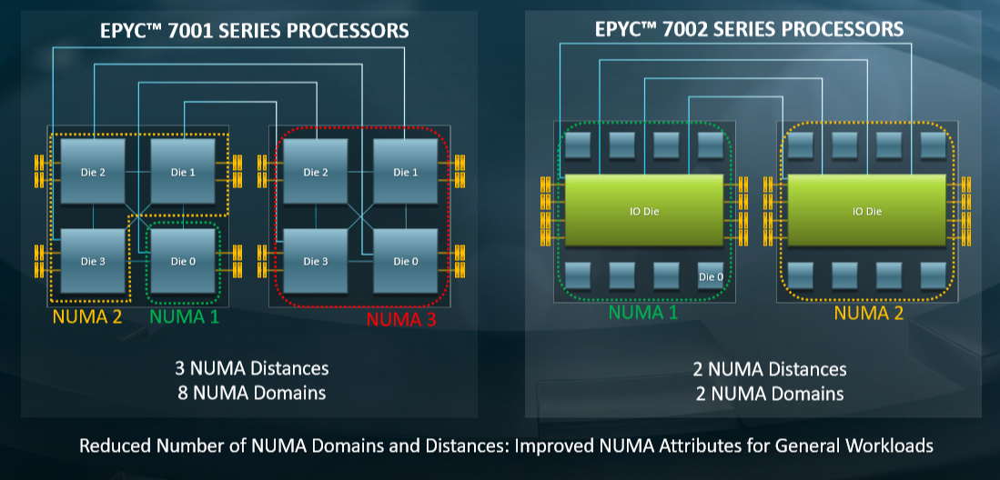
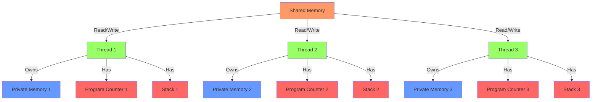
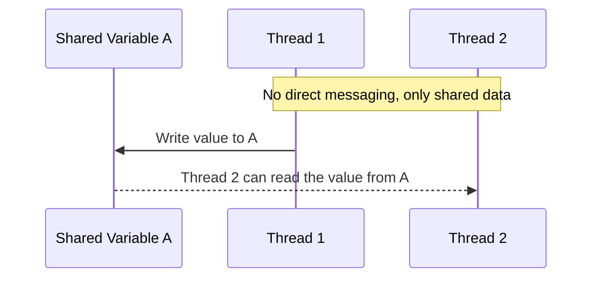
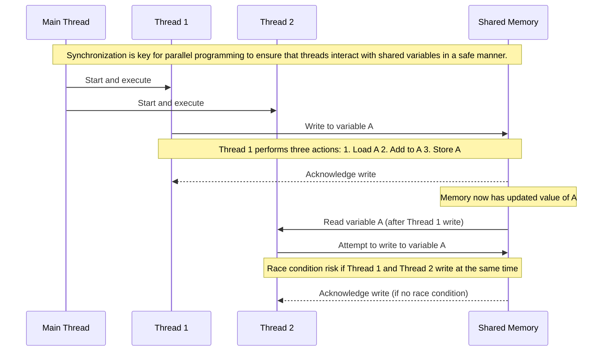
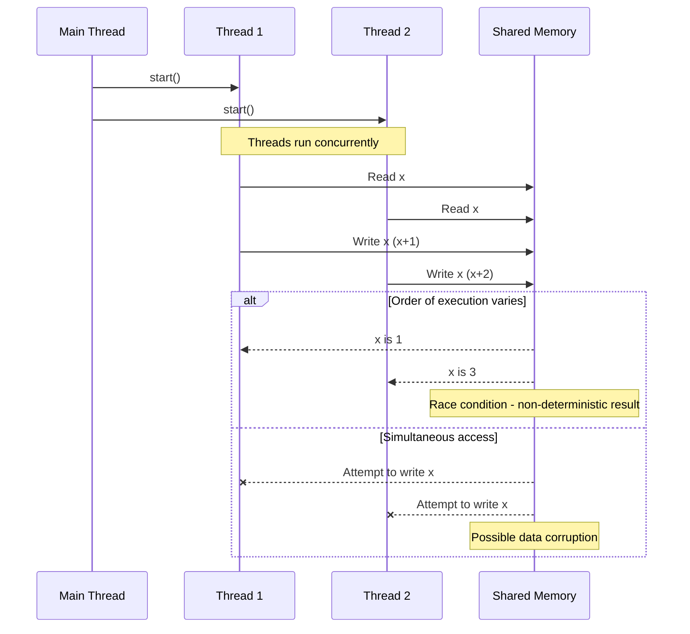
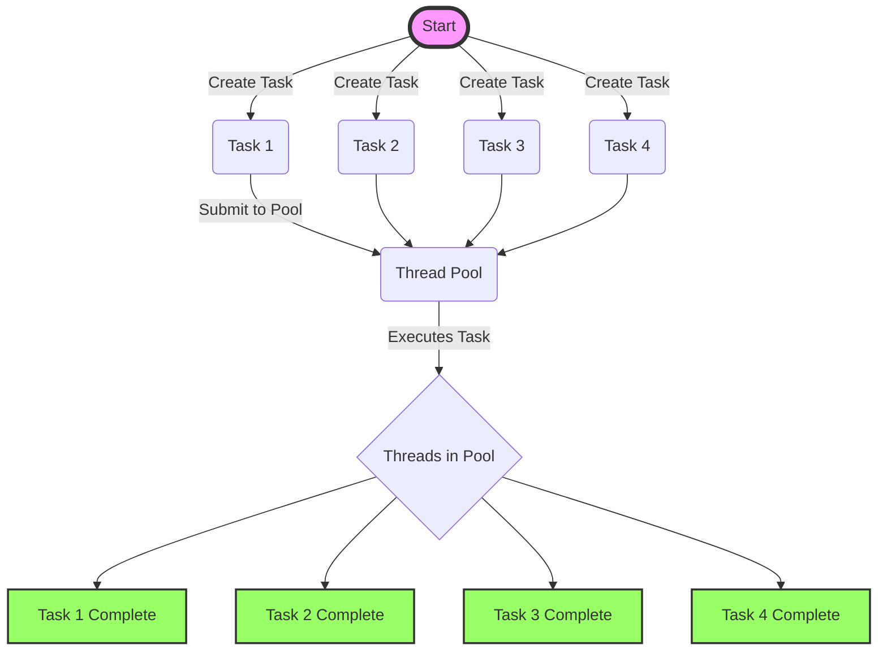
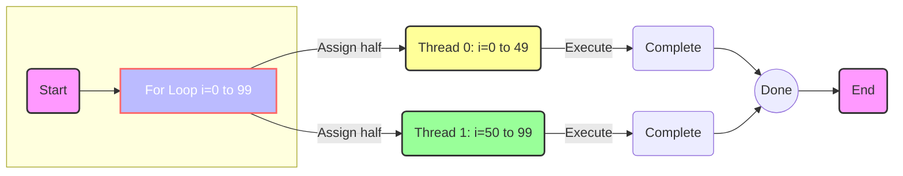
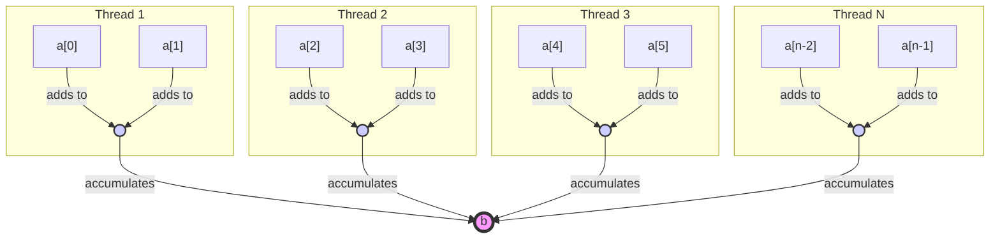

# Shared Memory Programming with OpenMP
## Lecture 1: Concepts

### Learning Objectives

By the end of this lecture, you should be able to:

* Define and distinguish between multi-core processors, multithreading, and multiprocessing.
* Understand the concept of shared memory systems and how they differ from distributed systems.
* Describe Uniform Memory Access (UMA) architectures and their implications for parallel programming.
* Explain Non-Uniform Memory Access (NUMA) architectures and their relevance to modern computing environments.
* Apply the basic concepts of threaded programming and appreciate the significance of threads in shared memory parallelism.
* Recognize the challenges of synchronization and race conditions in parallel programming and understand the need for managing them in code.

### Understanding Multi-Core Processors

Multi-core processors are the engines at the heart of modern computing, allowing
our devices to run faster and more efficiently. As the name suggests, these
processors contain multiple cores, or independent units, that read and execute
program instructions. The cores work in tandem to increase the amount of work a
computer can perform. Think of it as having several workers collaborating in a
factory, each taking on different tasks simultaneously to build a product
faster.

#### Multithreading vs. Multiprocessing

Multithreading and multiprocessing are two strategies that make use of the
multiple cores in a processor, but they do so in distinct ways.

**Multithreading** refers to the ability of a CPU to provide multiple threads of
*execution within a single process. It's akin to a single worker switching
*between tasks rapidly. Within a single core, this can be achieved through
*time-slicing—dividing CPU time into very small slices and assigning a slice to
*each thread. This creates the illusion that the threads are running in
*parallel, even though they're actually taking turns using the CPU's processing
*power. Multithreading is particularly useful for improving the efficiency of
*programs that perform many tasks that don't require full CPU power
*continuously.

**Multiprocessing**, on the other hand, involves using two or more CPUs within a
*single computer system to work on different tasks simultaneously. Here, each
*core operates independently to execute separate threads or processes, allowing
*for true parallelism. This method shines when it comes to running applications
*that can be broken down into multiple, independent tasks that can run
*simultaneously without interfering with each other.

To put it in simpler terms: if you were hosting a dinner party, multithreading
would be like having one chef who can quickly switch between preparing the
starter, main course, and dessert. In contrast, multiprocessing would be like
having three chefs, each dedicated to one course, all working at the same time.
Both approaches aim to serve the entire meal more quickly, but they use the
kitchen's resources differently.


By leveraging multiple cores through either multithreading or multiprocessing,
computers can perform a variety of tasks more swiftly and handle more complex
applications, making them indispensable tools in the realm of modern computing.

### Shared Memory Systems: Uniform Memory Architectures (UMA)

Uniform Memory Access (UMA) systems are a type of shared memory architecture where each processor core has equal access to the entire memory space. This means that no matter which core is accessing memory, the speed of access and the rights to read from or write to memory remain consistent across all cores. Here’s a clearer breakdown of what this entails:

- In parallel computing environments that leverage threaded programming, UMA systems are quite common. They allow for an efficient execution of multiple threads across various cores within a single CPU or across multiple CPUs.
- The central feature of UMA is the single, coherent memory space shared by all the processing units. Rather than having segregated pools of memory that are closer to some cores than others, UMA systems provide a level playing field in terms of memory access.
- Under UMA, any given memory location is accessible at the same speed, regardless of which core is making the access request. This uniform access is crucial for simplifying programming models because it means that the timing of memory access operations is predictable and does not depend on the specific core doing the access.
- Similarly, all cores have the same rights when it comes to memory operations. Whether it’s reading data from a memory address or writing data to it, all cores are granted equal authority, thus eliminating the need for complex memory management schemes that account for varying access rights.

UMA systems are typically found in systems where the scale of the processor count is not so large that the uniform access times would become a bottleneck. These systems are valued for their simplicity and are particularly effective for applications that do not demand the advanced memory performance optimizations of more complex architectures like NUMA.

#### Example 1: MacBook Air M1, 2020

The M1 chip in the MacBook Air is a system-on-a-chip (SoC) that integrates various components, including CPU, GPU, and memory, onto a single silicon die. This design is both power-efficient and capable of delivering high performance. The M1 features eight cores: four high-performance cores for demanding tasks and four high-efficiency cores for less demanding tasks, allowing for energy-saving when full power isn’t necessary. This is a classic multicore setup where the different cores can handle separate tasks simultaneously, enhancing the overall performance of the system.

In terms of shared memory, the M1 employs a **unified memory architecture**. This means that the CPU, GPU, and other processors share the same pool of memory, eliminating the need for separate memory for graphics and other tasks. This shared pool is accessible by all parts of the processor, which helps in improving the speed and efficiency of data processing.

When it comes to parallel programming, this architecture means that the cores can operate independently but share access to the same memory resources. This is what we refer to as **shared memory parallelism**, which allows for efficient data handling and task execution by leveraging all available cores.

Use the command below to get the hardware details of your MacBook Air:
`system_profiler SPHardwareDataType`

#### Example 2: Dell Latitude 5340

The Dell Latitude 5340 laptops are equipped with the Intel 13th Gen Intel® Core™ i7-1365U vPro® (12 MB cache, 10 cores, 12 threads, up to 5.2 GHz Turbo). Multi-core processors such as this example contain several CPU (central processing unit) cores on a single chip, which allows the computer to perform multiple tasks simultaneously with greater efficiency. This parallel processing capability can significantly speed up computing tasks and improve overall system responsiveness.

In terms of shared memory, these laptops also use a common memory accessible by all the cores, which enables efficient communication and data sharing among the cores. This unified approach to memory helps in enhancing multitasking and is essential for running complex applications smoothly.

For the Dell laptops you can also look at the hardware details:

* For Windows 11 using PowerShell:
```powershell
Get-ComputerInfo -Property "CsProcessors","CsMemory"
```
* For Windows 11 using WSL (Windows Subsystem for Linux):
```bash
cat /proc/cpuinfo
```
* For Linux:
```bash
lscpu
```

### Shared Memory Systems: Non-Uniform Memory Architectures (NUMA)

When we talk about most modern compute nodes found in clusters/supercomputers/Cloud the architecture becomes a bit more intricate than the idealized models. One of the complexities is how memory is structured and accessed, which brings us to the concept of NUMA—Non-Uniform Memory Access. NUMA is an approach to computer memory design that allows processors to access local memory faster than non-local memory, the memory that's local to another processor within the system.

The architecture of the AMD EPYC 7742 illustrates NUMA effectively - you are
also going to see more of this server later in the course. It is designed to
work as a two-socket system where each socket can house a 64-core processor.
This setup can support a large number of NUMA nodes—specifically, the EPYC 7742
supports up to 8 NUMA nodes. Each node provides a segment of memory that is
directly accessible to a subset of the processor cores with less latency
compared to memory located in other nodes.


<mark style="background-color: lightblue">
Figure 1: The figure contrasts the NUMA advancements from the earlier 7001
series to the 7002 series of the EPYC processors. With the 7002 series,
including the 7742 model, the number of NUMA nodes has been reduced, and the
distances between these nodes have been optimized. This tends to lead to better
performance because the processors can access memory with more uniform latency
and bandwidth.
<br>Source: [NextPlatform.com](https://www.nextplatform.com/2019/08/15/a-deep-dive-into-amds-rome-epyc-architecture/)
</mark>

A dual-socket AMD EPYC 7742 has 128 CPU cores in total. These are divided across
8 NUMA nodes, with each node containing an equal subset of the processing
threads. This means the memory is divided into 8 distinct domains, and the
threads within each domain can access their local memory faster than the memory
tied to other domains.

When designing and optimizing programs for such systems, it is crucial to
understand the NUMA layout because data locality can significantly impact
performance. If a thread frequently accesses data that's local to its NUMA node,
it will typically run faster due to reduced memory latency compared to a thread
that often needs to access data from another NUMA node.

Thus, while the hardware maintains a single logical address space for simplicity
and supports the correctness of programs, the underlying physical structure of
the memory and how different CPUs access it can have a profound impact on the
performance characteristics of an application. The goal with NUMA-aware
programming is to maximize the efficiency of local memory access and minimize
the latency introduced by inter-node communication.

### Threaded Programming Model

- The programming model for shared memory is based on the notion of threads.
  - Threads are like processes, except that threads can share memory with each other (as well as having private memory).
- Shared data can be accessed by all threads.
- Private data can only be accessed by the owning thread.
- Different threads can follow different flows of control through the same program.
  - Each thread has its own program counter and stack.
- Usually run one thread per physical CPU/core.



### Thread communication

- In order to have useful parallel programs, threads must be able to exchange data with each other.
- Threads communicate with each other via reading and writing shared data.
  - Thread 1 writes a value to a shared variable A.
  - Thread 2 can then read the value from A.
- Note: there is no notion of messages (i.e. point-to-point communication) in this model.



### Synchronisation

- By default, threads execute asynchronously.
- Each thread proceeds through program instructions independently of other threads.
- This means we need to ensure that actions on shared variables occur in the correct order: e.g. 
  - Thread 1 must write variable A before thread 2 reads it, or
  - Thread 1 must read variable A before thread 2 writes it. 
- Note that updates to shared variables (e.g. `a = a + 1`) are **not** atomic (un less you explicitly say they are)!
- Requires (at least) 3 instructions: load, add, store.
- If two threads try to do this “at the same time”, the instructions can be interleaved in time such that one of the updates may get overwritten (this is known as a *race condition*).



### Race conditions

- A race condition occurs when multiple threads access the same memory location without synchronization, and at least one of the accesses is a write.
- Without synchronization, different time orderings of the accesses may occur, possibly resulting in non-deterministic behavior.
  - Running the same program with the same inputs twice may give different results.
- Very nasty type of bug.
  - Not reliably detectable by conventional software testing procedures.



### Tasks

- A *task* is a piece of computation which can be executed independently of other tasks.
- In principle we could create a new thread to execute every task.
  - In practise this can be too expensive, especially if we have large numbers of small tasks.
- Instead tasks can be executed by a pre-exisiting *pool* of threads.
  - Tasks are submitted to the pool.
  - Some thread in the pool executes the task.
  - At some point in the future the task is guaranteed to have completed.
- Tasks may or may not be ordered with respect to other tasks.



### Parallel loops

- Loops are the main source of parallelism in many applications.
- If the iterations of a loop are *independent* (can be done in any order) then we can share out the iterations between different threads.
- For example, if we have two threads, then the following loop thread-0 could do iteration 0-49 and thread-1 could do iterations 50-99.   
```C
for (int i=0; i<100; i++) {
    a[i] += b[i]; 
}
```



### Reductions

- A *reduction* produces a single value from associative operations such as addition, multiplication, max, min, and, or. 
- For example:
```C
b = 0;
for (int i=0; i<n; i++){
    b += a[i];
}
```
- Allowing only one thread at a time to update `b` would remove all parallelism.
- Instead, each thread can accumulate its own private copy, then these copies are reduced to give final result.
- If the number of operations is much larger than the number of threads, most of the operations can proceed in parallel.




### Summary

In conclusion, this lecture has laid the groundwork for understanding the key concepts in shared memory programming with OpenMP. We've covered the foundational knowledge of multi-core processors, which are central to modern parallel computing, enabling both multithreading and multiprocessing to accelerate tasks. We've explored the architecture of shared memory systems, emphasizing the significance of UMA and NUMA configurations in contemporary computing and how these architectures impact the design and performance of parallel programs.

Threaded programming, a core component of parallel computing, has been introduced, providing insights into how multiple threads can work simultaneously to improve computational efficiency. We've also touched on synchronization and the challenges of race conditions, critical considerations for ensuring the correctness of parallel programs.

With this foundational knowledge, you're now equipped to delve deeper into the intricacies of parallel programming and leverage shared memory architectures to design and optimize sophisticated parallel applications.