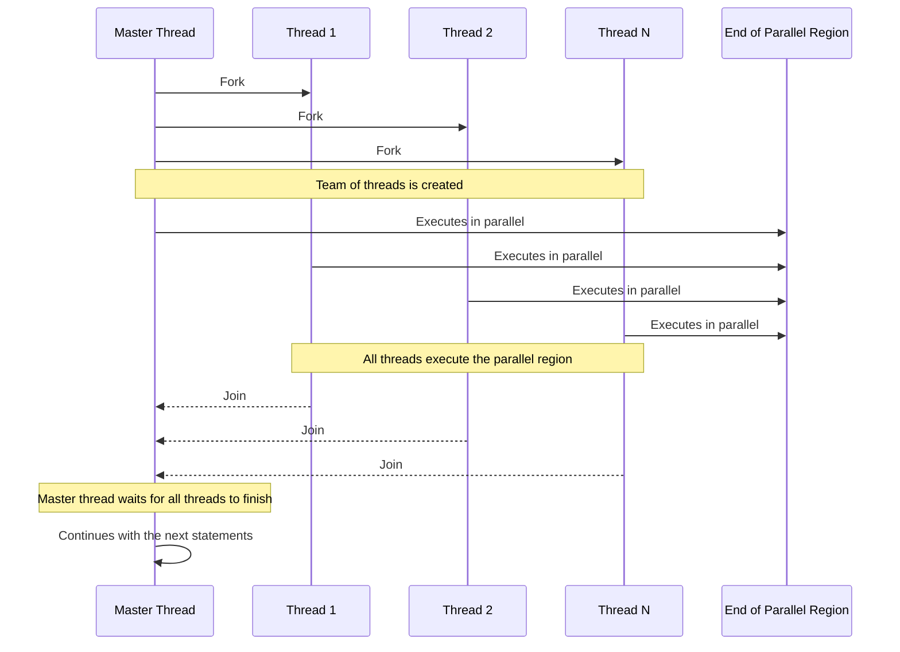
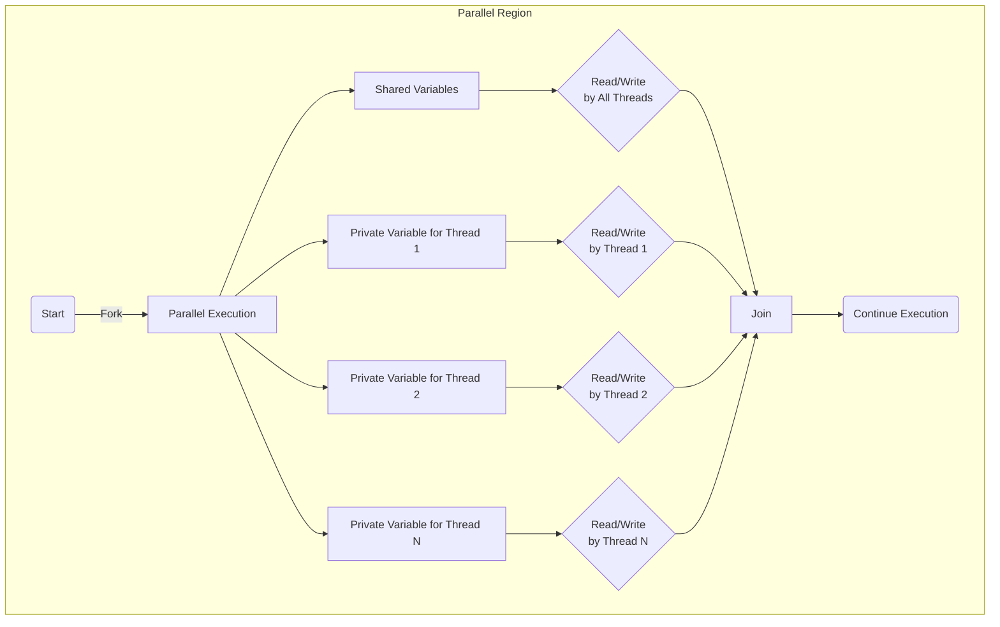

# Shared Memory Programming with OpenMP
## Lecture 2: OpenMP fundamentals

### Learning Objectives

By the end of this lecture, you should be able to:

- **Basic Concepts of OpenMP**: Understand how OpenMP uses threads and tasks to facilitate parallel programming in shared memory environments.
- **Utilize OpenMP Directives for Parallel Execution**: Identify and apply `#pragma omp` directives to manage parallel execution and explain how these directives behave when OpenMP is disabled.
- **Describe the Functioning of Parallel Regions in OpenMP**: Explain the creation and execution flow within parallel regions, including the fork-join model and the roles of the master and worker threads.
- **Understand Data Environment Management in OpenMP**: Differentiate between shared and private data within OpenMP parallel regions and discuss the implications for thread safety and synchronization.
- **Compile and Execute OpenMP Programs Using CMake**: Demonstrate how to set up, compile, and run OpenMP programs using CMake, and distinguish between using different compilers such as g++ and Intel.

### What is OpenMP?

- OpenMP is an API designed for programming shared memory parallel computers.
- OpenMP uses the concepts of *threads* and *tasks*.
- OpenMP is a set of extensions to Fortran, C and C++. *For clarity, we will focus on C++ in this module.*
- The extensions consist of:
  - Compiler directives.
  - Runtime library routines.
  - Environment variables.

### Directives and sentinels

OpenMP directives, which are specified using `#pragma omp` in the code, provide
instructions to the compiler for parallel execution. These directives allow you
to define blocks of code that should be executed in parallel, set up loops to be
divided among threads, and more.

If OpenMP is not enabled during the compilation, these `#pragma omp` directives
are treated as comments and thus, the code is compiled as regular sequential
C++. This allows for the same code base to be used for both parallel and
non-parallel execution, facilitating easier debugging and compatibility across
different systems that may not support OpenMP.

### Parallel region

- The *parallel region* is the basic parallel construct in OpenMP.
- A parallel region defines a section of a program.
- Program begins execution on a single thread (the master thread).
- When the first parallel region is encountered, the master thread
  creates a team of threads (fork/join model).
- Every thread executes the statements which are inside the parallel region.
- At the end of the parallel region, the master thread waits for the
  other threads to finish, and continues executing the next statements.



#### Skeleton example with `#pragma parallel`

``` c
int main(int argc, char *argv[]) {

  // Sequential code.

#pragma omp parallel
  {
    // Code here will be executed by all threads.
  }

  // Sequential code continues on master thread.
  
#pragma omp parallel
  {
    // Code here will be executed by all threads.
  }

  // Sequential code executed on master thread.
  return 0;
}
```

### Shared and private data

- Inside a parallel region, variables can either be *shared* or *private.*
- All threads see the same copy of shared variables.
- All threads can read or write shared variables.
- Each thread has its own copy of private variables:
  - These are invisible to other threads.
  - A private variable can only be read or written by its own thread.



### Parallel loops

- In a parallel region, all threads execute the same code.
- OpenMP also has directives which indicate that work should be divided up between threads (ie *worksharing*).
- OpenMP has extensive support for parallelizing loops.
  - Important as loops are the main source of parallelism in many applications.
- It is up to the programmer to ensure that the iterations of a
  parallel loop are *independent*.
- **Only loops where the iteration count can be computed before the
  execution of the loop begins can be parallelized in this way.**

### Synchronisation

The main synchronisation concepts used in OpenMP are:
- Barrier:
  - All threads must arrive at a barrier before any thread can proceed past it.
  - Implicit barriers are at the end of each parallel region and parallel loop.
- Critical region:
  - A section of code which only one thread at a time can enter.
  - Example use: Makes a section of code in a parallel region execute sequentially - often used when modifying shared objects and IO.
  - Note: Critical regions can be a performance bottleneck and should be used sparingly.
- Atomic accesses:
  - An update/read/write of a variable which can be performed only by one thread at a time.
  - Atomics only work on simple data types (int, float, etc).
  - Example use: Incrementing a shared counter.
  - Note: Atomics can be more efficient than critical regions, but are more limited in scope.

### Brief history of OpenMP

OpenMP stands as a cornerstone in the evolution of portable parallel programming, enabling developers to write code that scales efficiently across various shared memory architectures. In this course, we are focused on OpenMP 4.5 as it encompasses all necessary features for our curriculum. This version introduced key enhancements and refinements that form the backbone of effective parallel programming techniques we will explore.

We will not delve into the specifics of OpenMP's accelerator offloading capabilities, such as those for GPUs, as they are beyond the scope of this introductory course. For those interested in the latest developments and the most current state of compiler support for OpenMP, the OpenMP website offers a wealth of information and updates.

For further details, refer to the official OpenMP Specifications page at [OpenMP.org](https://www.openmp.org/specifications/).

## Exercise: Hello World

### Step 1: Create a simple OpenMP program

Create the following file: `hello_world.cpp`

``` c
#include <iostream>

int main() {
#pragma omp parallel
  {
    std::cout<<"Hello world"<<std::endl;
  }
  return 0;
}
```

### Step 2: Compile the program

OpenMP is built-in to most of the compilers you are likely to use. To compile an OpenMP program you need to add a (compiler-specific) flag to your compile and link commands.

For example, to compile an OpenMP program with `g++` you would use the `-fopenmp` flag:

``` shell
g++ -fopenmp -o my_program my_program.cpp
```
To compile an OpenMP program with `icpx` you would use the `-qopenmp` flag:

``` shell
icpx -qopenmp -o my_program my_program.cpp
```

The problem is that this can get laborious and complicated. Therefore, take the
oppertunity to learn how to use CMake to compile your code.

### Alternative Step 2 (CMake):

To compile a simple OpenMP-enabled C++ program using both the Intel compiler and
g++, you will need a CMake configuration file (`CMakeLists.txt`). Below, I
provide an example of such a file along with a brief explanation of each
component, and then I'll guide you through the steps to build and run the
program using CMake.

#### Step 2.1: Create CMake configuration file, `CMakeLists.txt`

```cmake
cmake_minimum_required(VERSION 3.10)
project(HelloWorld)

find_package(OpenMP REQUIRED)

add_executable(hello_world hello_world.cpp)

if(OpenMP_CXX_FOUND)
    target_link_libraries(hello_world PUBLIC OpenMP::OpenMP_CXX)
endif()
```

#### Explination of `CMakeLists.txt`

* **cmake_minimum_required(VERSION 3.10)**: Specifies the minimum version of CMake required to process this configuration file.
* **project(HelloWorld)**: Sets the name of the project and enables languages used (default is C and C++).
* **find_package(OpenMP REQUIRED)**: Tells CMake to find and set up OpenMP. The `REQUIRED` option causes CMake to fail if OpenMP can't be found.
* **add_executable(hello hello.cpp)**: Adds an executable target called `hello_world` to be built from the source file `hello_world.cpp`.
* **target_link_libraries(hello PUBLIC OpenMP::OpenMP_CXX)**: Links the OpenMP libraries to the target executable. The `OpenMP::OpenMP_CXX` is an imported target created by the `find_package(OpenMP)` command, which includes the necessary compile options, link options, and definitions for compiling with OpenMP.

#### Step 2.2: Build

At this point you should have the following directory structure:
``` shell
% ls
CMakeLists.txt hello_world.cpp
```

Now, create a build directory, configure the project using CMake and build the project.
``` shell
% mkdir -p build
% cd build
% cmake ..
% cmake --build .
```

You can also set the environment for the Intel compiler and specify the C++ compiler explicitly:
``` shell
cmake .. -DCMAKE_CXX_COMPILER=icpc  # Configure the project to use the Intel compiler
```

#### Step 3: Run the program

``` shell
./hello_world            # Execute the compiled program
```

The number of OpenMP threads used in the program are controled by the environment variable `OMP_NUM_THREADS`. By default, the number of threads is equal to the number of cores on the system. However, this can vary depending on the implementation and system configuration. In some systems, it defaults to the number of virtual processors, which includes hyperthreaded cores. You can set the number of threads by setting the environment variable before running the program.

It is important to check your specific system or the documentation for your compiler and OpenMP implementation to understand the exact default behavior. If you need a specific number of threads, it's recommended to set `OMP_NUM_THREADS` explicitly in your environment to ensure consistent performance across different platforms.

##### Example: MacOS or Linux

``` shell
OMP_NUM_THREADS=4 ./hello_world
```

##### Example: Windows PowerShell

``` powershell
$env:OMP_NUM_THREADS=4

./hello_world.exe
```

##### Example output

``` shell
Hello world
Hello world
Hello world
Hello world
```

### Summary

We explored the foundational concepts of Shared Memory Programming using OpenMP, focusing on how it utilizes threads and tasks to facilitate parallel programming within shared memory environments. Key points covered include:

1. **OpenMP Basics**: We introduced OpenMP as a versatile API designed to enhance programming across shared memory systems. The lecture highlighted OpenMP's extension to standard programming languages like Fortran, C, and C++, emphasizing its utilization of compiler directives, runtime library routines, and environment variables for managing parallel execution.

2. **Directives and Parallel Execution**: We discussed the critical role of `#pragma omp` directives in defining parallel regions of code, allowing for simultaneous execution by multiple threads. This segment underscored how, without OpenMP enabled, these directives default to comments, preserving the code's functionality as a sequential program.

3. **Parallel Regions and Thread Management**: The lecture explained the fork-join model, where a master thread spawns a team of threads at the start of a parallel region, each executing concurrently. The conclusion of a parallel region sees the master thread resynchronizing with the worker threads, ensuring all tasks are completed before moving forward.

4. **Data Environment Management**: We delved into how data within a parallel region can be classified as shared or private, affecting how threads interact with data. Shared variables are accessible by all threads, while private variables are isolated to individual threads, enhancing data security and integrity during parallel operations.

5. **Compiling and Executing with CMake**: Practical instruction was provided on setting up, compiling, and running OpenMP programs using CMake, catering to different compilers like g++ and Intel. This part of the lecture aimed to equip you with the skills to independently compile and manage OpenMP programs.

6. **Parallel Loops and Synchronization**: The lecture covered the structuring of parallel loops, a common source of parallelism, emphasizing the necessity for independent loop iterations. We also covered synchronization techniques like barriers and critical regions to manage the challenges of concurrent thread operations.
